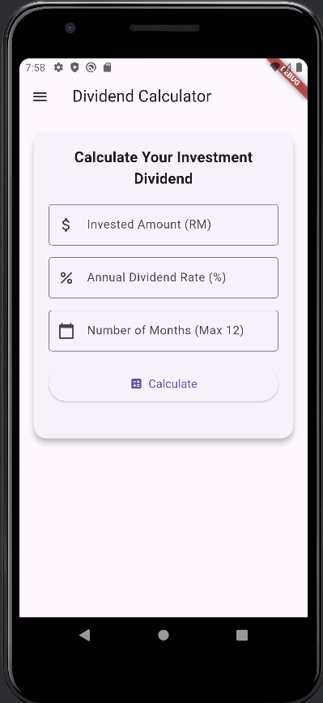
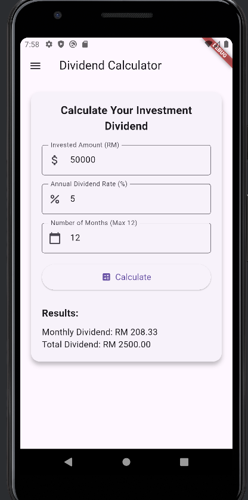
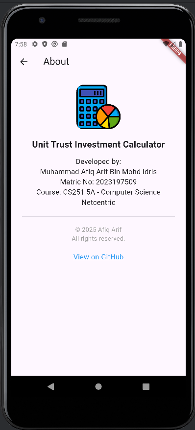

# 📱 Unit Trust Investment Calculator App

A Flutter mobile app that calculates monthly and total dividends from unit trust investments.

---

## 🎯 Objective

To allow users to:

* Input invested amount, annual dividend rate, and months invested
* Calculate monthly and total dividend earnings
* View developer info, GitHub link, and app details in an About Page

---

## 📸 UI Screenshots

### 🏠 Home Page

| Input & Calculation                     |
| --------------------------------------- |
|  |

### ✅ Calculation Results

| Output Display                           |
| ---------------------------------------- |
|  |

### 📖 About Page

| App Info, Icon, GitHub                    |
| ----------------------------------------- |
|  |

---

## ⚙️ Features

* 📥 Input fields for:

  * Invested amount (RM)
  * Annual dividend rate (%)
  * Number of months (Max: 12)

* 📊 Output:

  * Monthly Dividend (2 decimal places)
  * Total Dividend (2 decimal places)

* 🧭 Navigation Drawer:

  * Home
  * About

* 📄 About Page includes:

  * App icon
  * Author info (name, matric, course)
  * Clickable GitHub repository link

---

## 📂 APK Download

You can download and install the APK here:

👉 [Download APK](https://drive.google.com/file/d/1bXkEXrXBYhrFyuJqr-I1cdCohT6t1-As/view?usp=sharing)

> *(Replace with your actual Google Drive / GitHub Release / Dropbox link)*

---

## 🎥 Presentation Video

Watch the full walkthrough and explanation here:

👉 [Watch Video](https://youtu.be/vys-MaNwr0A)

---

## 🔧 Technologies Used

* Flutter SDK
* Dart Programming Language
* Android Studio
* Git & GitHub

---

## 👨‍💻 Author

| Name                              | Matric No  | Course                                 |
| --------------------------------- | ---------- | -------------------------------------- |
| Muhammad Afiq Arif Bin Mohd Idris | 2023197509 | CS251 5A - Computer Science Netcentric |

GitHub: [https://github.com/YOUR\_USERNAME/unit-trust-app](https://github.com/AfiqSova/unit-trust-app)

---

## ✅ Status

✅ Completed – Fully functional and submitted

---

## 📜 License

This project is part of a university assignment and not licensed for commercial use.
=======
